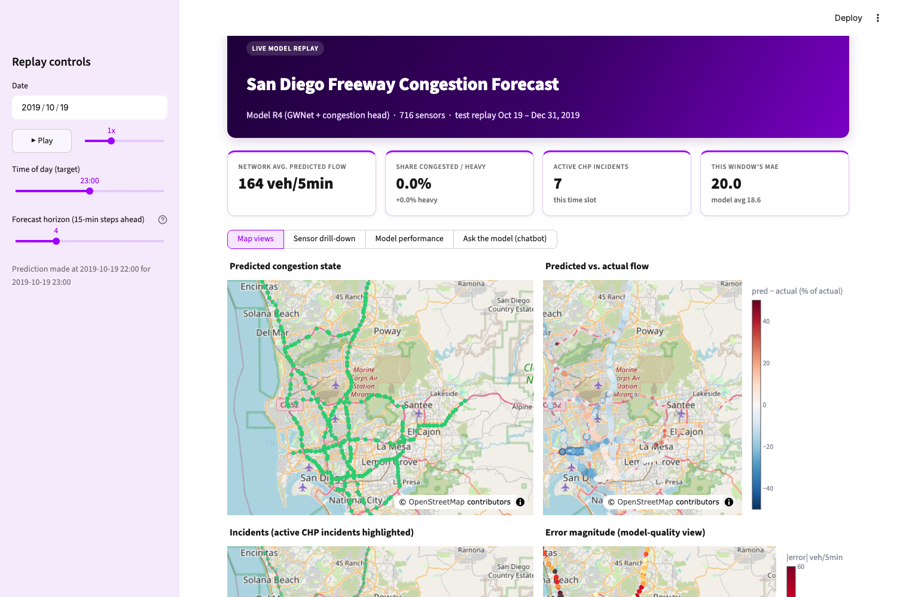
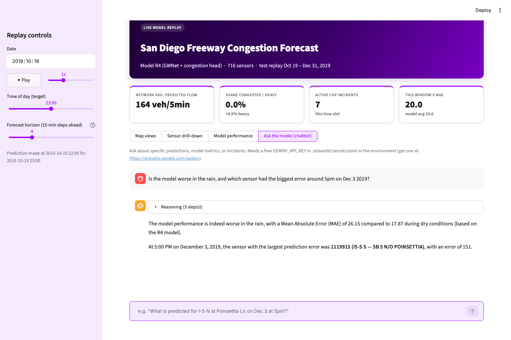
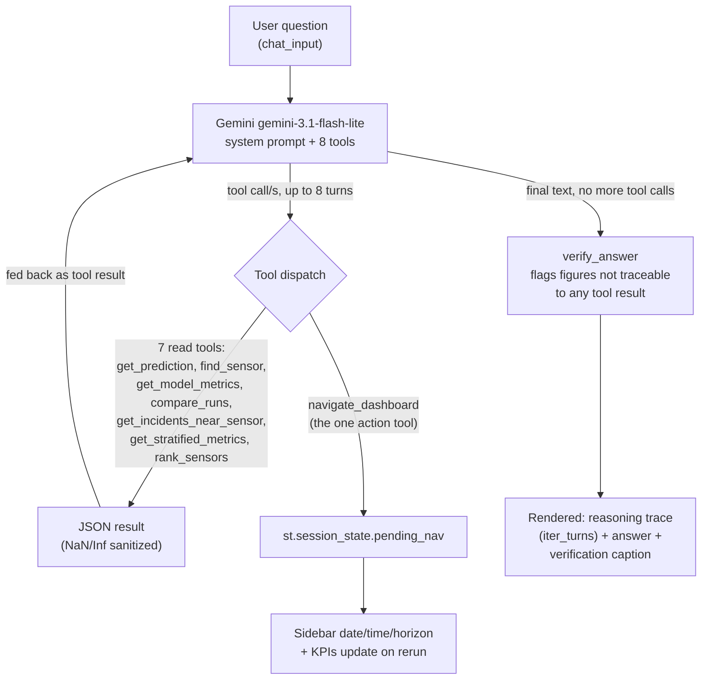

# San Diego Freeway Congestion Forecasting — End-to-End Project Report

This is the complete internal record of the project: motivation, dataset, every methodological
decision and why it was made, every gate and its result, the full numeric results, the
statistical verification behind the headline claim, known limitations, the dashboard/chatbot
built on top of the model, and how to reproduce all of it. The [README](README.md) is the
short version for a visitor; this document is the long version for anyone who wants to check
the work.

Team of five, working by role rather than by name in this document: **M1** (modeling /
evaluation), **M2** (data / predictions), **M3** (dashboard), **M4** (chatbot), **M5**
(integration / QA / deck).

---

## 1. Goal

Predict short-horizon (up to 3 hours, 12 steps of 15 minutes) traffic **flow** and **congestion
state** on the San Diego subset of [LargeST](https://arxiv.org/abs/2306.08259) — 716 sensors
across San Diego freeways, 15-minute resolution, calendar year 2019 (35,040 timesteps) — and
beat the LSTM baseline the LargeST paper reports for this subset (avg MAE 26.35, which the paper
itself also reports for its own GWNet baseline: 17.74).

Two things distinguish this project from just re-running the paper's GWNet:

1. **A congestion classification head**, trained jointly with the flow regression, predicting
   free / heavy / congested at every sensor and horizon — LargeST only provides flow, so the
   label itself first had to be constructed and validated (Section 4).
2. **A feature-ablation study** (six cumulative feature sets, R0→R6) plus a **graph ablation**
   (road adjacency × learned adaptive adjacency, four combinations) to characterize which
   engineering choices actually move the numbers, backed by a paired bootstrap rather than
   single-run deltas (Section 8).

## 2. Dataset and compute constraints

- **LargeST-SD**: 716 sensors, 15-min flow (veh/5min, mean of three 5-min station readings per
  LargeST's own preprocessing), Jan 1 – Dec 31 2019. Splits follow LargeST's own convention:
  train ends 2019-08-07 20:15, val through 2019-10-20 00:45, test 2019-10-19 22:15 – 2019-12-31
  23:45 (7004 test windows after LargeST drops the last partial batch).
- **PeMS D11** (the raw source LargeST itself derives from): station 5-minute and hourly flow +
  occupancy files, plus CHP incident records, downloaded manually for San Diego District 11 and
  cut down locally with `pems_filter.py`. Used to (a) build the congestion label LargeST doesn't
  provide, and (b) independently cross-check LargeST's own flow numbers (Section 3).
- **Compute**: originally planned as free-tier Colab T4 sessions (fixed ~75-minute step budget,
  checkpointing every quarter-epoch to Drive). The Colab-via-Windsurf remote-kernel route failed
  (no `google.colab` module available that way), so from 2026-09-13 onward every stage — data
  prep, all six full 16-epoch training runs, and the final evaluation — ran locally on an
  **Apple M2 Air, 8GB RAM**, on Apple's MPS backend: micro-batch 8 accumulated to an effective
  batch of 64, fp32 throughout (mixed precision measured only ~11% faster on MPS, not worth the
  added complexity), ~0.26 GiB and ~55–63 ms per training window. A full 16-epoch run took ~4.8
  hours (~270s per quarter-epoch checkpoint) with other apps closed; six full runs were queued
  overnight back-to-back via a detached shell script that resumes from checkpoints and skips
  already-finished runs.

## 3. Gate 0 — data audit (2026-09-12/13)

Before writing any model code, the raw data was audited end to end:

- **HL (historical-lag) baseline reproduced exactly** against LargeST's own numbers, confirming
  the local data pipeline matches the paper's.
- **DST**: the timestamp index is wall-clock, not elapsed-time — March 10 02:xx is all-zero
  (the skipped DST hour), confirmed and documented rather than silently mishandled.
- **Zeros are outages**, not genuine zero-flow: 94% of zero-runs longer than a day are outages.
- **The 999 flow ceiling**: only 37 cells hit exactly 999, all on 6–8 lane sensors — later
  independently confirmed (Gate L era) against PeMS's own 5-minute archive to be genuine
  sensor/field saturation, not a pipeline artifact.
- **5,049 cells imply >3,200 veh/h/lane** — a physically implausible rate, flagging the lane-count
  metadata as suspect for some sensors. On manual inspection, only **one** sensor (ID 1108333)
  had an implausible lane count (metadata said 2, its flow implies ~5) and was hand-corrected —
  a one-off fix based on a plausibility check, not a systematic re-audit of all 716 sensors.
- **HA (historical-average) profile baseline**: test MAE 29.8 vs. val 21.9 — ties the LSTM
  baseline at a 2-hour horizon and beats it at 3 hours, immediately showing the LSTM baseline is
  not a strong bar at long horizons.
- **Gate 0b follow-up**: ~75% of the val→test MAE gap traced to Thanksgiving week and Dec 21–31
  (Christmas-period HA MAE 127 vs. a median day of 23); 19 sensors shift level by >20% between
  splits (likely lane-detector failures, not modeled further); ≥2-hour stuck-sensor runs total
  458, concentrated on 28 sensors, mostly overnight.

## 4. Building the congestion label — Stage L (2026-09-15)

LargeST provides flow only. The congestion label (free / heavy / congested) is derived from
**PeMS occupancy**, which LargeST does not carry through:

1. **Cross-validated PeMS against LargeST first**: 15-minute flow matches LargeST in 99.98% of
   cells (by ID and wall-clock, independently); hourly correlation 0.99998; LargeST silently
   drops 5-minute flows above 999 (biasing those specific windows down); about 10% of
   sensor-hours in PeMS are below 50% observed (PeMS's own imputation); PeMS actually has *real*
   data for 17% of the hours LargeST is missing (86 sensors) — so PeMS is a strictly informative
   addition, not a weaker substitute.
2. **Critical occupancy fit per sensor** on training-only hours: the occupancy value where the
   upper (p95) envelope of the flow–occupancy curve peaks and then declines defines that
   sensor's "critical" occupancy. Fitted for 278 sensors (median 0.155); 392 sensors have no
   observed congested branch and fall back to the network median; 46 have too little data.
3. **Hourly label repeated onto the 15-minute grid** (each 15-min step inherits its hour's
   class). Validated against a genuinely 15-minute label built independently for one week
   (Nov 4–10): 95.7% agreement, congested recall 0.90 / precision 0.85 — the hourly
   simplification loses some precision but is directionally reliable.
4. **Face validity checks**: class shares are stable across splits (train/val/test all ~85–88%
   free, ~7–9% heavy, ~5–6% congested); congestion peaks at 07:00 and 16:00 on weekdays; the
   ten most-congested sensors by weekday-peak share are recognizable bottlenecks (SR-78 at
   Nordahl 0.78, SR-163 at Robinson Ave 0.65, I-5 at Poinsettia Ln 0.60–0.61, among others);
   congestion spreads spatially like a real queue (×12.9 lift at neighboring sensors vs. ×3.6 for
   a random-pair control, with no upstream/downstream asymmetry visible at hourly resolution).
5. **The key methodological finding**: a flow-only proxy label (e.g., "flow above some
   threshold = congested") was also tried and rejected — it has precision 0.07 / recall 0.03
   against the occupancy-based label, and flags 46.8% of Christmas Day as "congested" (correct
   occupancy-based answer: 0.03%). Flow alone conflates *low demand* with *free-flowing*, and
   cannot tell a holiday from a jam. This is why the occupancy-based label, despite being more
   work to build, is the one actually used.

## 5. Matching incidents — Stage I

49,198 CHP incident records for District 11 were classified, parsed for lanes-blocked (only
possible for 9.7% of records; 15.5% of collisions specifically), and matched to the nearest
sensor: 92.6% of incidents matched successfully. An event study around matched-incident start
times shows congestion at the nearest upstream sensor rises about +14 percentage points at the
incident hour, with a smaller pre-rise (+6 points at one hour before — congestion often precedes
and likely contributes to the crash, not just follows it) and decay back to baseline over about
3 hours. In the test split, sensor-hours matched to an active incident show a 14.8% congested
share vs. 5.2% for non-incident cells — incidents are a real, if statistically small (~3% of
test cells), signal.

## 6. Model and training

**Architecture**: Graph WaveNet (GWNet), the LargeST paper's own architecture (311,164 params,
matching the paper's reported count), extended with a **multitask congestion head**
(`GWNetMT` — the base GWNet plus a classification head sharing its backbone; 329,632 params
total at λ=15 loss weight on the classification term, class weights `1/√freq` computed from the
training split). One architecture quirk, confirmed and left as-is (it doesn't affect
correctness, only interpretation of the parameter count): the base GWNet's final `gconv`/`bn`
layer (7,264 params) never receives gradient, because the output is taken from the skip
connections *before* that final graph-conv layer.

**Graph ablation**: GWNet combines a fixed road-network adjacency with a learned adaptive
adjacency (2×716×10 = 14,320 params). Four combinations were trained on the R0 input set to
separate their contributions — see Section 8 for the numbers.

**Gates before the full runs**:

- **Gate 1 (overfit test)**: since a 100-window full-memorization run is infeasible for GWNet at
  N=716 (859K targets vs. ~304K params), the actual test was a 4-window full-batch memorization
  run (loss must fall below 10% of its start and keep falling), backed by a 100-window run as a
  supplementary sanity curve. Passed on the M2 (152.4 → 4.6).
- **Gate 2 (subset run)**: 5 epochs on a 60-day subset. Failed one criterion ("beats the HA
  profile baseline at horizons 1–3") — Gate 3 later showed this was simple undertraining, not a
  real problem with the setup.
- **Gate 3 (first 25% of R0)**: 3 epochs on the full dataset — val-subset MAE 43.4 → 26.5, beating
  both HL and the HA profile at horizons 1–3 (profile still ahead at horizon ≥4, expected at 3
  epochs). This passed and set the final training recipe: **every full run is 16 epochs**, WSD
  learning-rate schedule (warmup → 1e-3 constant → cosine decay over the last 30%), seed 2023.

**Six feature-ablation training rows, cumulative**:

| Run | Adds on top of the previous row | Input channels |
|---|---|---|
| R0 | Base GWNet, LargeST's own 3 input channels (flow, time-of-day, day-of-week) — flow-only, single-task | 3 |
| R1 | Same inputs as R0, but with the multitask congestion head | 3 |
| R2 | + missing-data mask and causal fill for missing input flow | 4 |
| R3 | + utilization, flow-per-lane, cyclical time features, static per-sensor attributes | 33 |
| R4 | + holidays, day-before/after, holiday-period flag, SDUSD school-in-session | 38 |
| R5 | + weather (5 San Diego ASOS stations, inverse-distance-weighted onto sensors, causal) | 46 |
| R6 | + CHP incident features | 50 |

Plus three graph-ablation rows on the R0 input set: **A1** (road adjacency only), **A2**
(adaptive adjacency only), **A3** (no graph — `normalize_adj_mx` returns an empty adjacency for
an unrecognized type, which is how the no-graph condition is implemented).

**Missing-input fill** (used from R2 onward) was chosen empirically on hidden validation cells
(1% of observed cells, artificially masked): "same weekday, last 4 weeks" median (MAE 16.9) beat
"previous 7 days" median (34.6), the train-only profile (21.9), and zero-fill as LargeST itself
effectively does (255.0, i.e. terrible — this is *why* R2 exists as its own row). Missing input
cells are 2.28% of the total (2.25% genuine zeros/outages + 0.03% newly-detected ≥2-hour stuck
runs on the input side).

**Calendar features** (R4): 180 school days, matching the San Diego Unified School District
calendar.

**Weather** (R5): NOAA/Iowa State ASOS archive, 5 stations (SAN/MYF/SEE/CRQ/NKX), routine METARs
only, inverse-distance-weighted onto each sensor, strictly causal (no future weather leaks into
a window). Timezone handling was asserted correct (temperature peaks at 12:00 local, not UTC).
Rain affects 7.3% of train steps, 0.6% of val steps, 8.4% of test steps (~147 measurable hours) —
an uneven distribution across splits worth keeping in mind when reading the rain-stratum result
in Section 9.

## 7. Training infrastructure

All six ablation runs (R1–R6) plus the three graph-ablation runs (A1–A3) were queued to run
unattended, in dependency order, via a detached shell script (`logs/queue_all.sh` in the working
data directory) that resumes any interrupted run from its own checkpoint and skips any run whose
final-results JSON already exists. Order: R2 → A2 → R1 → R3 → R4 → R5 → R6 (A1/A3 were run
earlier, separately). The full queue took from 2026-09-15 12:38 to 2026-09-18 06:20 — roughly 65
hours of wall-clock time for five sequential ~5-hour training runs plus idle gaps waiting on AC
power (the harness running these sessions kills background watchers under memory pressure, so
runs were structured to be resumable rather than relying on a single unbroken process).

## 8. Results

All numbers are **test-set** averages across all 12 forecast horizons (15 min to 3 hours ahead)
unless noted otherwise.

### 8.1 Headline comparison against baselines

| Model | avg MAE | avg RMSE | avg MAPE |
|---|---|---|---|
| HL (historical lag) | 60.79 (paper) | — | — |
| HA / profile baseline (ours) | 29.8 (test) | — | — |
| LSTM (paper) | 26.35 | — | — |
| GWNet (paper, flow-only) | 17.74 | — | — |
| **R4 (ours)** | **18.56** | **30.97** | **12.25%** |

R4 is 29.6% below the LSTM baseline and close to (not quite beating) the paper's own flow-only
GWNet — expected, since R4 is solving a harder joint problem (flow *and* congestion
classification) under a much smaller training budget (16 epochs, one seed, laptop GPU) than the
paper's own training recipe.

### 8.2 Full feature-ablation table (test set)

| Run | avg MAE | avg RMSE | avg MAPE | macro-F1 | F1 free / heavy / congested |
|---|---|---|---|---|---|
| R0 | 20.35 | 33.48 | 13.4% | — (flow-only) | — |
| R1 | 20.41 | 33.70 | 13.65% | 0.768 | — |
| R2 | 20.39 | 33.63 | 13.81% | 0.769 | — |
| R3 | 18.90 | 31.60 | 12.63% | 0.780 | — |
| **R4** | **18.56** | **30.97** | **12.25%** | **0.790** | 0.975 / 0.665 / 0.730 |
| R5 | 18.64 | 31.03 | 12.27% | 0.787 | — |
| R6 | 18.70 | 31.22 | 12.26% | 0.787 | — |

### 8.3 Graph ablation (all on R0's input set)

| Run | Graph configuration | avg MAE | avg RMSE | avg MAPE |
|---|---|---|---|---|
| R0 | road adjacency + adaptive adjacency (full) | 20.35 | 33.48 | 13.4% |
| A2 | adaptive adjacency only | 21.84 | 35.89 | 14.16% |
| A1 | road adjacency only | 22.90 | 36.34 | 15.13% |
| A3 | no graph | 27.92 | 44.06 | 17.84% |

The two adjacency sources are complementary rather than redundant: adaptive-only recovers ~80%
of the full graph's gain over no-graph, road-only recovers ~66%, and having both is better than
either alone.

### 8.4 Classification baselines (for context on macro-F1)

| Baseline | macro-F1 | recall free / heavy / congested |
|---|---|---|
| Persistence (hold last-known class) | 0.656 | 0.951 / 0.496 / 0.522 |
| Profile-class (train-fitted majority class per sensor/slot/day-type) | 0.761 | 0.969 / 0.656 / 0.667 |
| **R4** | **0.790** | (F1, not recall, above: 0.975 / 0.665 / 0.730) |

### 8.5 Stratified test flow-MAE (every run × every stratum)

| Run | overall | rain | dry | incident | non-incident | peak | off-peak | holiday-period | non-holiday | true=free | true=heavy | true=congested |
|---|---|---|---|---|---|---|---|---|---|---|---|---|
| R0 | 20.347 | 28.171 | 19.636 | 30.087 | 20.035 | 32.067 | 17.268 | 24.737 | 19.735 | 17.455 | 30.093 | 44.327 |
| A1 | 22.901 | 29.872 | 22.267 | 32.685 | 22.587 | 36.015 | 19.456 | 26.624 | 22.382 | 19.939 | 35.179 | 49.464 |
| A2 | 21.841 | 29.829 | 21.115 | 31.832 | 21.521 | 35.236 | 18.322 | 26.056 | 21.254 | 18.702 | 32.745 | 47.882 |
| A3 | 27.921 | 32.418 | 27.512 | 38.201 | 27.591 | 45.573 | 23.283 | 28.764 | 27.803 | 24.249 | 46.577 | 61.970 |
| R1 | 20.406 | 28.368 | 19.682 | 30.214 | 20.092 | 32.135 | 17.325 | 25.393 | 19.711 | 17.595 | 29.992 | 42.776 |
| R2 | 20.388 | 29.232 | 19.585 | 30.017 | 20.080 | 32.694 | 17.156 | 25.878 | 19.623 | 17.684 | 29.373 | 42.503 |
| R3 | 18.903 | 26.662 | 18.198 | 28.755 | 18.587 | 29.813 | 16.037 | 24.684 | 18.097 | 16.035 | 27.453 | 40.867 |
| **R4** | **18.557** | **26.153** | **17.867** | **28.400** | **18.242** | **29.205** | **15.760** | **23.833** | **17.821** | **15.650** | **27.401** | **40.598** |
| R5 | 18.637 | 25.791 | 17.987 | 28.416 | 18.323 | 29.298 | 15.836 | 23.865 | 17.908 | 15.762 | 27.111 | 40.288 |
| R6 | 18.701 | 26.099 | 18.028 | 28.530 | 18.385 | 29.494 | 15.865 | 24.023 | 17.958 | 15.807 | 27.293 | 40.524 |

Mask coverage (share of test sensor-timesteps): rain 8.30%, incident 3.07%, peak (weekday
6–9am/3–7pm) 20.76%, holiday-period 12.32%, true class free/heavy/congested 74.58%/6.21%/4.67%.

## 9. Gate E — final statistical verification (2026-09-18)

Point-estimate deltas between ablation rows are not, by themselves, evidence that a feature
helped — they could be noise. Gate E answers this with a **paired day-block bootstrap**: 1000
resamples over the 74 distinct calendar days the test-set forecast origins fall on, computing a
95% CI on the MAE delta for each row-to-row comparison (negative = improvement).

| Comparison | ΔMAE | 95% CI | Significant? |
|---|---|---|---|
| R1 → R2 (missingness fix) | −0.018 | [−0.140, 0.135] | No |
| R2 → R3 (utilization/time/static features) | −1.486 | [−1.811, −1.233] | **Yes** |
| R3 → R4 (holiday/school calendar) | −0.346 | [−0.604, −0.131] | **Yes** |
| R4 → R5 (weather) | +0.080 | [−0.082, 0.264] | No |
| R4 → R6 (incidents) | +0.144 | [−0.029, 0.343] | No |
| A3 → A1 (road graph) | −5.020 | [−5.732, −4.345] | **Yes** |
| A3 → A2 (adaptive graph) | −6.079 | [−6.939, −5.274] | **Yes** |
| A3 → R0 (both graphs) | −7.574 | [−8.488, −6.680] | **Yes** |

**Conclusion: R4 is the statistically best model.** The R2→R3 and R3→R4 feature additions are
real, CI-excludes-zero improvements. R4→R5 and R4→R6 are not distinguishable from noise in
aggregate — but the aggregate hides a genuine asymmetry, checked directly against the stratified
table above:

- **R4 → R5 (weather) inside the rain stratum specifically**: 26.153 → 25.791 MAE, an
  improvement — masked in the aggregate only because rain is just 8.3% of test cells. This is a
  real, if minor, positive result worth reporting as such rather than as "weather didn't help."
- **R4 → R6 (incidents) inside the incident stratum specifically**: 28.400 → 28.530 MAE, *worse*
  — unlike weather, the incident feature shows no localized benefit even where incidents are
  active. This is a genuine negative result, not just dilution, and is reported as one rather
  than quietly dropped.

**Decision, taken at this gate: ship R4** as the model behind the dashboard, the chatbot, and the
final deck.

## 10. Limitations

- **Congestion is measured, not observed directly.** The free/heavy/congested label comes from
  PeMS occupancy — itself an inferred signal (per-lane loop-detector on-time), not a direct queue
  measurement. Thresholds are fitted per sensor and validated (Section 4), but remain a modeling
  choice, not ground truth.
- **PeMS occupancy is itself partly imputed.** ~10% of underlying sensor-hours are below 50%
  observed and were excluded from *label fitting*, but the *flow* series those hours feed (via
  LargeST) was not separately filtered — flow numbers may include PeMS's own imputation there.
- **The 999 flow ceiling** looks like genuine sensor/field saturation on a handful of stations,
  confirmed against PeMS's own 5-minute archive, not a pipeline artifact.
- **One hand-corrected lane count** (sensor 1108333, metadata said 2 lanes, observed flow implies
  ~5) — a one-off plausibility fix, not a systematic audit of all 716 sensors' metadata.
- **Test-only holidays.** Thanksgiving and Dec 21–31 fall only in the test split, never in
  train/val, so the model generalizes holiday behavior from smaller training-set analogues (New
  Year's, Memorial Day, July 4th). R4's gain from the holiday/school features is real on this
  split, but the biggest test-period anomalies are exactly the days with the least similar
  training exposure.
- **Single seed, fixed epoch budget.** Every run used seed 2023 and 16 epochs, versus the paper's
  much longer schedule (~80 epochs, data-center GPU). The bootstrap CIs above quantify
  *test-sampling* uncertainty, not *training-seed* uncertainty (not measured, given the compute
  budget) — row-to-row deltas smaller than typical seed-to-seed noise should be read with that
  in mind.
- **MPS numeric precision.** Training/inference ran in fp32 throughout on Apple's MPS backend;
  the bootstrap and stratified metrics were computed on CPU/MPS in float64 after inference, so
  this doesn't affect their precision, only training speed (mixed precision measured only ~11%
  faster, not worth the added complexity for a laptop-only budget).
- **Day-block bootstrap blocks by the forecast's origin day**, not by each horizon's own target
  day — a documented simplification (a 3-hour-ahead forecast made at 23:00 targets the next
  calendar day) that doesn't materially change grouping for all but a small fraction of
  late-evening windows.
- **Weather and incident coverage are limited by what's actually in the test period**: ~147 hours
  of measurable network rain, ~3% incident-affected cells — real effects, on a comparatively
  small slice of data, so the R5/R6 stratified numbers should be read as suggestive rather than
  tightly bounded.

## 11. Dashboard and chatbot

A local Streamlit dashboard and chatbot were built on top of the R4 model for the final demo
(2026-09-21). Kept **local-only** by choice — no public deployment, no viewer-supplied API keys —
after weighing Streamlit Community Cloud's free-tier resource limits against a class-demo
timeline.

**Prediction cache** (`scripts/export_predictions.py`): runs R4 once over the full 7,004-window
test set (`conglib.load_run` rebuilds the exact model + inputs from its own checkpoint;
`conglib.predict_mt` does a single cached forward pass), saving predicted/true flow (float16) and
predicted/true class (int8) to a ~107MB local `.npz`. No PyTorch is needed to *read* this file
afterward — only to build it — which keeps the dashboard itself lightweight.

### 11.1 Map views and live KPIs

**Map views** (`dashboard/map_view.py`, Plotly `Scattermap`, no Mapbox token needed): four
blocks, all driven by the same sidebar date/time/horizon controls —

1. **Predicted congestion state** — sensors colored by predicted free/heavy/congested class.
2. **Predicted vs. actual flow** — color = signed % error, size = actual flow volume.
3. **Incidents** — congestion state map with sensors under an active CHP incident highlighted.
4. **Error magnitude** — |predicted − actual| flow, a model-quality view distinct from the raw
   comparison.

A **KPI header row** (network average predicted flow, % congested/heavy, active CHP incidents,
this window's MAE against the model's overall average) recomputes live off whatever date/time/
horizon the sidebar is set to — not static text. An **ops watchlist** below the maps
(`data.top_bottlenecks`) ranks sensors congested-first for the current slot. An **auto-play**
control (▶/⏸ + speed) steps the time slider forward automatically for a live-feeling replay. A
**model-performance view** brings the ablation bar chart, the Gate E bootstrap forest plot, and
the Section 9–10 findings directly into the app as FINDING/LIMITATION callout boxes, so the
statistical case for R4 is available without leaving the dashboard. Plus a **sensor drill-down**
view (actual-vs-predicted flow line chart for any sensor across a chosen day, at three horizons).

The visual language (`dashboard/theme.py`) uses Accenture's palette (purple `#A100FF` / near-black
/ white) for chrome — headers, cards, callouts — while deliberately leaving the traffic-domain
semantic colors (free = green, heavy = orange, congested = red in the maps) untouched: brand color
governs decoration, never a meaning-bearing data color.

### 11.2 Agentic chatbot architecture

The chatbot (`dashboard/chatbot.py`) was originally built against the Claude API per the initial
plan, switched on 2026-09-19 to **Google Gemini's free tier** by request, then deliberately
upgraded from basic tool-calling into something that reads as genuinely agentic: visible
reasoning, autonomous multi-step investigation, an ability to act on the dashboard rather than
only describe it, and a self-check before presenting an answer.

- **Eight tools, not five** — two additions specifically enable autonomous multi-step
  investigation instead of single-fact lookups: `get_stratified_metrics` exposes the rain/incident/
  peak/holiday breakdown computed for Gate E (Section 11 findings) but never reachable via chat
  before; `rank_sensors` ranks all 716 sensors at any arbitrary time by congestion, error, or flow,
  not just the dashboard's currently-displayed slice. A compound question ("is the model worse in
  the rain, and which sensor had the biggest error around 5pm on Dec 3?") now chains both in one
  turn rather than requiring two separate questions.
- **One action tool** — `navigate_dashboard` is the only tool with a side effect beyond returning
  data: it validates the requested time against the test window, then writes
  `st.session_state['pending_nav']`, which the dashboard resolves into the sidebar's date/time/
  horizon on the next render. This is what turns the chatbot from something that only *describes*
  the dashboard into something that can *act on* it.
- **A visible reasoning trace** — `chatbot.iter_turns()` derives a per-turn `{steps, text}`
  grouping purely from the existing conversation history at render time (no separate bookkeeping
  structure, to avoid an entire class of state-desync bug), rendered as an expandable panel
  listing every tool call, its arguments, and its result before the final answer.
- **A zero-extra-API-call self-check** — `chatbot.verify_answer()` flattens every numeric value out
  of the turn's tool results into a "known good" set, regex-extracts candidate numbers from the
  final answer text (explicitly excluding ISO/natural-language dates, clock times, 7-digit sensor
  IDs, bare years, and route mentions like "I-15"/"163 Merge" — see the bug notes below for why),
  and flags anything that doesn't approximately match. Deliberately programmatic, not a second LLM
  call, to protect the free-tier quota — with the accepted limitation that correct arithmetic the
  model derives from two tool values (a stated delta) is flagged too, since only literal
  tool-returned values count as ground truth.

### 11.3 Bugs found and fixed

Four real bugs surfaced only through actually driving the live app — none were caught by
`streamlit.testing.v1.AppTest` alone, which is necessary but not sufficient for this kind of UI:

1. **Chat input unclickable, Safari-only.** `st.chat_input` has documented cross-browser bugs when
   nested inside `st.tabs()` (streamlit/streamlit issues #7814, #8564) — visible but unresponsive
   to clicks/focus in some engines. Confirmed Safari-specific (worked in Chromium) by having the
   user test both browsers on the same machine.
2. **`400 INVALID_ARGUMENT` crash from the Gemini API on a `rank_sensors`-triggering question.**
   `rank_sensors` returns `NaN` for sensors with no actual reading (LargeST's missing-data
   sentinel); the first-attempt guard (`df.where(df.notna(), None)`) doesn't work — pandas
   silently reverts `None` back to `NaN` when assigned into a float64 column. Python's own
   `json.dumps` tolerates the resulting NaN (a non-standard literal token, allowed by default), so
   it never crashed locally — but Gemini's own JSON parser is strict and rejects the literal `NaN`
   token once it reaches the actual HTTP request. Fixed with a recursive sanitizer applied to
   *every* tool's result, not just this one.
3. **The self-check flagging real sensor names as "unverified figures."** PeMS station names embed
   route numbers in free text ("15 SB N/O Carrol Cyn", "NB15 @ 163 Merge") indistinguishable by
   regex alone from real metrics. Fixed by stripping any exact string the tool results themselves
   returned (sensor labels are "known good" by construction) plus a route-number regex backstop.
4. **Moving `chat_input` to the top level (the Safari fix) made the *entire app* auto-scroll to
   the bottom on every load.** On the installed Streamlit version (1.64), a top-level `chat_input`
   anywhere in the script triggers `stAppScrollToBottomContainer` for the whole page, not just the
   chat area — the dashboard would open on "Ops Watchlist" instead of the hero/KPI row. Root cause:
   `st.tabs()` runs (and mounts in the DOM) every tab's code on every rerun regardless of which is
   visually selected, which is what caused both this and bug 1. **Fix: replaced `st.tabs()`
   entirely with `st.segmented_control()` and plain `if/elif` blocks** — a plain `if/elif` is not a
   Streamlit container at all, so only the selected view's widgets are ever mounted, eliminating
   both bugs from one structural change rather than two separate patches.

**Verification performed** (not just "it compiles"): every `data.py`/`map_view.py`/`chatbot.py`
function was called directly against the real R4 cache and checked against known numbers; a full
`streamlit.testing.v1.AppTest` run hit zero exceptions across every view; and — because the bugs
above specifically don't show up that way — a real running server was driven with Playwright
(and, for the Safari-specific bug, the user's own browser) through compound tool-chaining
questions, a dashboard-navigation command, and a full view-switch-and-back, confirming the
reasoning trace, the verification caption, the KPI updates, and the page's scroll position all
behave correctly together.

## 12. Reproducing this project

1. Download the LargeST San Diego files (`sd_his_2019.h5`, `sd_meta.csv`, `sd_rn_adj.npy`,
   `2019/*.npy`) from LargeST's own release into `data/traffic/sd_2019/`.
2. Open `congestion_sd.ipynb` and run cells top to bottom, respecting its own gate structure
   (`⛔ GATE n — STOP` markdown cells mark points meant for a human review before continuing —
   this notebook was built and run exactly that way, gate by gate, not all at once).
3. For the congestion label and incident features, download PeMS D11 station/incident files
   manually from pems.dot.ca.gov and run `pems_filter.py` before Stage L/I.
4. Train the six ablation runs (and the three graph-ablation runs) via `work/cong/train.py` or
   the notebook's own training cells — each is a 16-epoch run on the recipe in Section 6.
5. Run `scripts/export_predictions.py R4` to build the dashboard's prediction cache.
6. `pip install -r dashboard/requirements.txt`, add a free Gemini key to
   `.streamlit/secrets.toml`, `streamlit run dashboard/app.py`.

## 13. Status as of this report

Done: Gates 0/0b/1/2/3, Stage L, Stage I, Stage F, all nine training runs, Gate E, the local
dashboard and agentic chatbot (visual redesign, 8-tool tool-chaining, reasoning trace, self-check,
dashboard-navigation action — all verified end-to-end, including the three bugs in Section 11.3).

Open: the progress-review deck (`presentation/Progress_Review_2026-09-15.pptx`) predates R3–R6,
Gate E, and the dashboard's Accenture-themed redesign, and still needs updating before the
2026-09-21 final demo.
