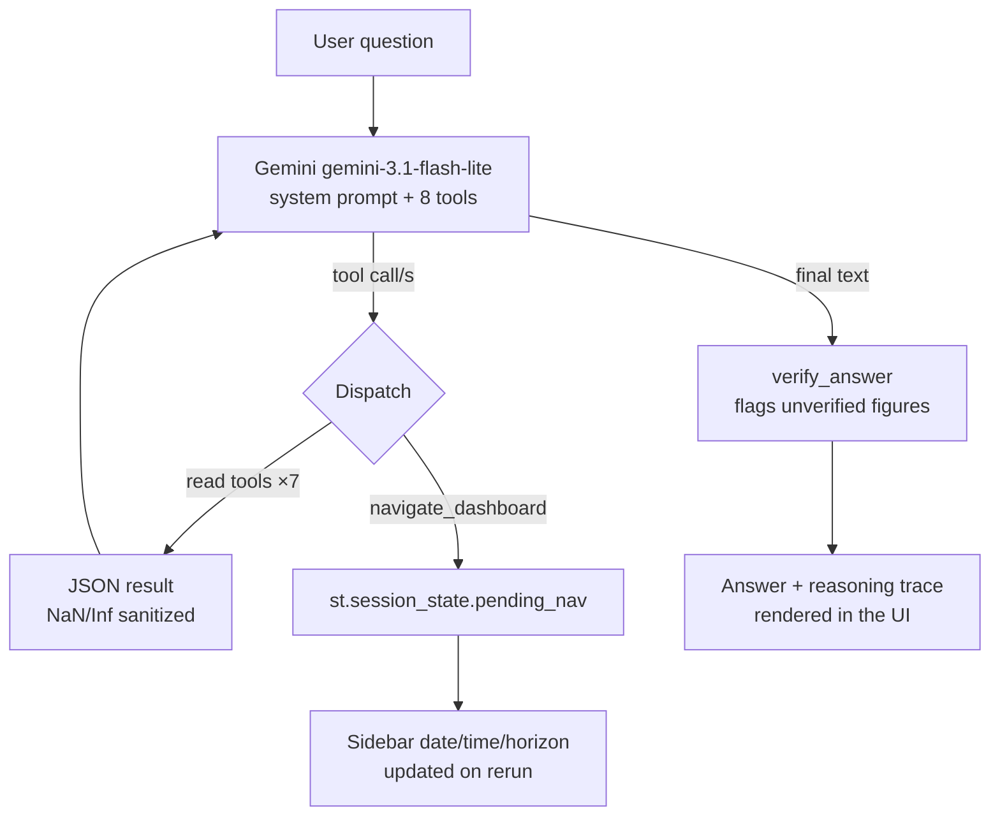

# San Diego Freeway Congestion Forecasting

Capstone project: forecast traffic **flow** and **congestion state** (free / heavy / congested)
on the San Diego subset of [LargeST](https://github.com/liuxu77/LargeST) (2019, 716 sensors,
15-minute resolution) using a Graph WaveNet (GWNet) model with a multitask congestion
classification head, evaluated against the paper's published baselines.

For the full end-to-end writeup (methodology, every gate, every result, every limitation) see
**[PROJECT_REPORT.md](PROJECT_REPORT.md)**. This README is the quick-start.

## Headline result

The final model (**R4**) beats the LSTM baseline reported in the LargeST paper by **29.6%** on
test-set MAE, with a congestion-classification macro-F1 of **0.790**:

| Model | Test avg MAE | vs. LSTM (26.35) | Congestion macro-F1 |
|---|---|---|---|
| HL (historical-lag) | 60.79 | — | — |
| LSTM (paper baseline) | 26.35 | — | — |
| GWNet (paper, flow-only) | 17.74 | −32.7% | — |
| **R4 (ours, flow + congestion)** | **18.56** | **−29.6%** | **0.790** |

A day-block bootstrap (1000 resamples, 74 test days) confirms the feature gains behind R4 are
statistically real, and that two further feature additions (weather, incidents) are *not*
distinguishable from noise in aggregate — see the report for the full ablation table and the
per-stratum nuance behind that finding.

## Dashboard and agentic chatbot


A local Streamlit app on top of R4: a live KPI row (network flow, congestion share, active
incidents, this-window MAE vs. the model average), four synchronized map views, an auto-play
replay control, a sensor drill-down, an in-app model-performance tab (the ablation + bootstrap
charts from the report), and a chatbot that goes beyond simple Q&A tool-calling:


- **8 tools**, not just lookups — `get_stratified_metrics` and `rank_sensors` let it chain
  multiple calls to answer investigative questions ("does X help when Y", "which sensors are
  worst right now") on its own, rather than answering from a single fact.
- **A visible reasoning trace** — every answer shows exactly which tools it called, with what
  arguments, and what came back, in an expandable panel.
- **It can act on the dashboard, not just describe it** — `navigate_dashboard` actually moves the
  sidebar's date/time/horizon controls, closing the loop between the conversation and the UI.
- **A zero-extra-API-call self-check** — flags any number in its final answer that doesn't trace
  back to an actual tool result, before you ever see it.



See [PROJECT_REPORT.md](PROJECT_REPORT.md) §14–15 for the full architecture, every bug hit and
fixed along the way (a Safari-only `chat_input` incompatibility, a NaN-in-JSON crash, and a
whole-app auto-scroll regression), and why each fix works.

## Repository layout

```
congestion_sd.ipynb       Main notebook — every stage of the project, gated (audit → training →
                          labeling → feature engineering → final evaluation), meant to be read
                          and re-run top to bottom.
work/cong/                Shared training/eval code imported by the notebook and by train.py:
  conglib.py                model (GWNet + congestion head), training step, evaluation, and the
                             load_run/predict_mt helpers used for the dashboard export
  features.py                factored-input assembly for the R2-R6 feature-ablation rows
  train.py                    standalone script for a background/resumable training run
scripts/
  export_predictions.py    Runs a finished model once over the full test set and saves a compact
                          local prediction cache for the dashboard/chatbot (no torch needed to
                          read it afterward).
dashboard/                Local Streamlit app — Accenture-purple themed, 4 views (map, sensor
                          drill-down, model performance, chatbot) via a segmented-control switch
                          (not st.tabs — see §14.4 in the report for why):
  app.py                    page layout, sidebar/KPI state, view routing
  data.py                    cached data access + ranking/stratified-metrics helpers
  chatbot.py                  Gemini tool-calling loop, reasoning-trace + self-check helpers
  theme.py                     palette, CSS injection, KPI-card/callout HTML helpers
presentation/             Chart-generation and slide-deck scripts for the progress reviews, plus
                          the dashboard screenshots above.
pems_filter.py            Cuts a local PeMS D11 download down to the San Diego sensors/period
                          used here (raw PeMS files are not redistributed in this repo).
data/traffic/congestion/results/
                          Small result/metric JSON files for every run and gate (kept in the repo;
                          the large raw/processed data and checkpoints are not — see below).
```

## What's *not* in this repo, and why

LargeST's raw/processed San Diego files, PeMS extracts, model checkpoints, and the full
prediction cache are all multi-hundred-MB to multi-GB binary artifacts — not something a git
repo should carry. They're excluded via `.gitignore` and regenerated as follows:

- **LargeST SD data** — `congestion_sd.ipynb`'s first cell (`Bootstrap`) clones
  [liuxu77/LargeST](https://github.com/liuxu77/LargeST) and expects the San Diego `.h5`/`.npz`
  files at `<project>/data/traffic/sd_2019/` (downloaded separately from LargeST's own release —
  see their repo for the download link).
- **PeMS D11 data** — download manually from [PeMS](https://pems.dot.ca.gov/) (station 5-min/hour
  files + CHP incident files for San Diego District 11), then run `pems_filter.py` to cut it down
  to what the notebook's Stage L/I cells expect.
- **Feature/label factor files** (`inputs_r2/4a/4b/4c.npz`, `incidents.npz`, `cong_label.npz`) —
  produced by the notebook's Stage F/L/I cells from the two data sources above.
- **Model checkpoints and the prediction cache** — produced by `train.py` (or the notebook's
  training cells) and `scripts/export_predictions.py` respectively.

## Running the dashboard

```bash
pip install -r dashboard/requirements.txt
python scripts/export_predictions.py R4          # needs a trained R4 checkpoint first
cp .streamlit/secrets.toml.example .streamlit/secrets.toml   # add your free Gemini key
streamlit run dashboard/app.py
```

Get a free Gemini API key at <https://aistudio.google.com/apikey>. The chatbot uses
`gemini-3.1-flash-lite` — check <https://ai.dev/rate-limit> if you hit a quota error on a
different model.

## Team

Five roles: ML/evaluation, data/predictions, dashboard, chatbot, integration/QA/deck.

## Status

Final demo: 2026-09-21 (dashboard + chatbot, live). See [PROJECT_REPORT.md](PROJECT_REPORT.md)
for what's done and what's still open.
